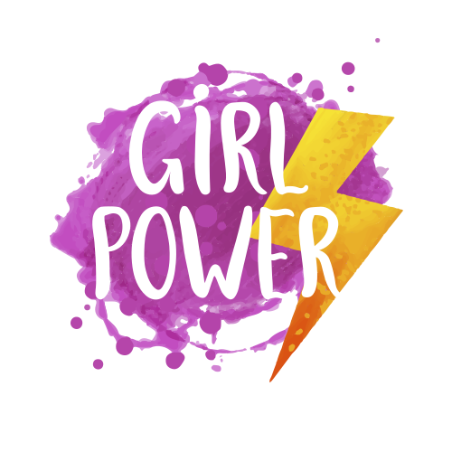
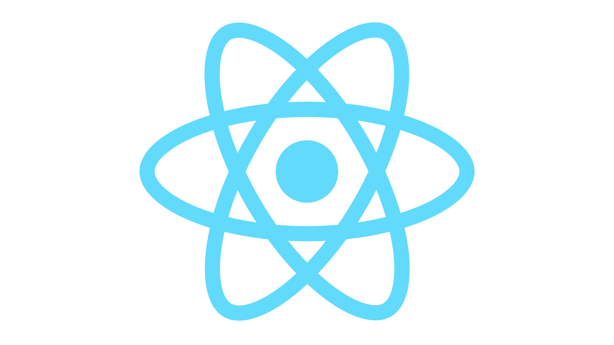

### Hi everyone , i'm Angélica Bonilla! 👋

```javascript
Const angelicaBonilla = {
  code: ["Javascript", "HTML", "CSS"],
  preprocessor: ["SASS"],
  tools: ["React", "Firebase", "NodeJs","Webpack", "Jest"]
}
```

 > *i'm a passionate woman in tech!*
 > 
 > 🌻 Since I started to learn about computer science fields,I fell in love with Front End.
 >
 > 🌻Curiosity and Growth Mindset
 >
 > 🌻Agile methodologies
 >
 > 🌻Teamwork is better to succeed!
 >
 >
 >
 
*im currently working with:*


<div style="display: flex;">


</div>
<br>
<div style="display: flex;">


</div>

*im currently learning:*
 <div style="display: flex;">



</div>


*What i want to learn soon:*
<div style="display: flex;">


</div>


